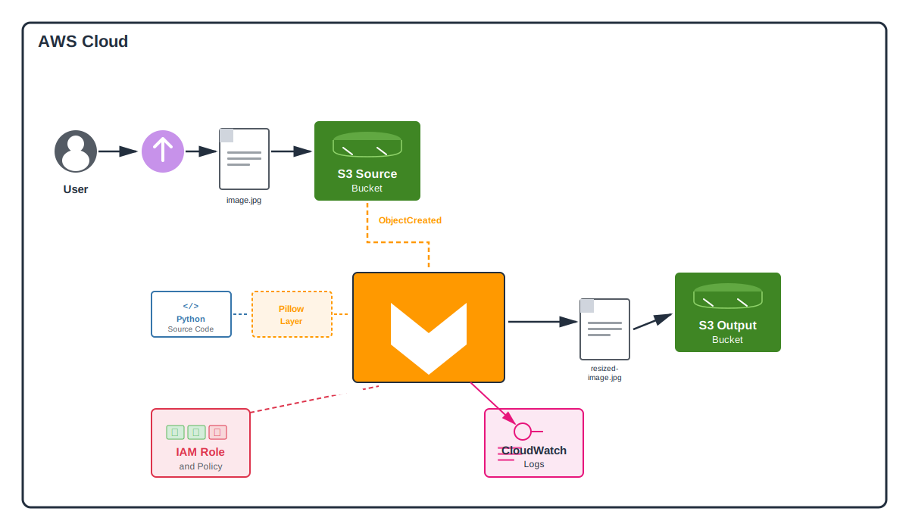

# Image Resizer Project in AWS

## Overview

This project is a POC for an event-driven serverless architecture that  resizes images uploaded to an S3 bucket. When an image is uploaded to the source bucket, it triggers a Lambda function that downloads the image, resizes it to half its original dimensions using Pillow (PIL), and uploads the resized version to a destination bucket.

The entire infrastructure is provisioned with Terraform.


## Architecture

### Architecture Diagram


### Architecture Overview

- **Lambda Function:** Deployed as `s3_resize_function`, listens for S3 events and processes image resizing using Python and Pillow
- **S3 Source Bucket:** Created with prefix `resize-source-`; stores original images to be resized
- **S3 Output Bucket:** Created with prefix `resize-output-`; stores the resized images
- **Lambda Layer:** Contains the Pillow (PIL) library for image processing capabilities
- **S3 Event Notification:** Configured on the source S3 bucket to trigger the Lambda function when a new object is created (ObjectCreated:Put event)
- **IAM Roles and Policies:** An IAM role is assumed by the Lambda function with attached policies that grant permissions to read from the source bucket, write to the output bucket, and create CloudWatch logs

## Tools

- **Terraform**: Used for infrastructure as code (IaC) deployment
- **Python**: Used to write the Lambda function
- **Pillow (PIL)**: Python imaging library for resizing operations
- **Boto3**: The AWS Python SDK and client library to wrap API calls


## Quick Start: ClickOps Guide

While this project is designed for Terraform deployment, you can manually test the Lambda function through the AWS Console:

1. Create two S3 buckets (source and destination)
2. Create a Lambda layer with Pillow installed
3. Create a Lambda function with the provided Python code
4. Add the Pillow layer to your Lambda function
5. Set the `DESTINATION_BUCKETNAME` environment variable
6. Configure S3 event notification on the source bucket
7. Upload an image to test

## Terraform Deployment Instructions


### 1. Move to your projects folder
Move into your projects folder (inside the TheoWAF directory on your computer for example).

### 2. Clone the Repository

```sh
git clone https://github.com/aaron-dm-mcdonald/aws-image-resizer.git
cd aws-image-resizer
```

### 3. Terraform workflow

```sh
terraform init
terraform apply -auto-approve
```

### 4. Get the Bucket Names

Note the bucket names during terraform runtime or execute:

```sh
terraform output s3_source_bucket_name
terraform output s3_output_bucket_name
```

You can also find both bucket names in the AWS Console under S3.

### 5. Manual testing workflow 

#### a. Upload an image
```sh
aws s3 cp <LOCAL-IMAGE-PATH> s3://<YOUR-SOURCE-BUCKET-NAME>/
```

Example:
```sh
aws s3 cp ~/Pictures/photo.jpg s3://resize-source-abc123/
```

#### b. Verify Resized Image in Output Bucket

```sh
aws s3 ls s3://<YOUR-OUTPUT-BUCKET-NAME>/
```

You should see a file named `resized-photo.jpg` (or whatever your original filename was, prefixed with "resized-").

#### c. Download and Compare

```sh
aws s3 cp s3://<YOUR-OUTPUT-BUCKET-NAME>/resized-<original image name> <target file path to download it>
```

### Cleanup

To destroy all resources created by Terraform:

```sh
terraform destroy -auto-approve
```

Note: Buckets are configured with `force_destroy = true`, so they will be deleted even if they contain objects.# aws-image-resizer

## Automated testing

```bash

# Create virtual environment
python -m venv venv

# Activate it (Git Bash on Windows)
source venv/Scripts/activate

# Install dependencies
pip install boto3 pillow

# Run the test
python ./test/test_resizer.py
```


## Notes

- Ensure that your IAM role allows S3 read access on the source bucket and write access on the output bucket
- The Lambda function runs in response to S3 ObjectCreated:Put events, so any image upload will trigger it
- Supported image formats depend on Pillow capabilities (JPEG, PNG, GIF, BMP, etc.)
- Lambda's `/tmp` directory has a 512 MB limit; very large images may fail
- The resizing reduces both dimensions by 50% using the thumbnail method

## Lambda Function Code Breakdown

This Lambda function listens for new file uploads to an S3 bucket and automatically resizes images to half their original dimensions.

### **Key Steps in the Code**
1. **Receive S3 Event**: Lambda is triggered by S3 ObjectCreated event containing bucket and object details
2. **Download Original Image**: Uses boto3 S3 client to download the uploaded image to Lambda's `/tmp` directory
3. **Resize Image**: Opens the image with Pillow and uses the thumbnail method to reduce dimensions by 50%
4. **Upload Resized Image**: Uploads the processed image to the destination bucket (specified via environment variable) with "resized-" prefix
5. **Cleanup**: Lambda automatically cleans up `/tmp` directory after execution

### **Lambda Code**
[The Lambda Function Source Code](src/lambda_function.py)

## File Structure

```
.
├── 1-auth.tf                      # AWS provider configuration
├── 2-lambda.tf                    # Lambda function and layer definitions
├── 3-storage.tf                   # S3 buckets and event notifications
├── 4-iam.tf                       # IAM roles, policies, and permissions
├── 5-output.tf                    # Terraform outputs
├── src/
│   └── lambda_function.py         # Lambda function source code
├── assets/
│   └── lambda_function.py         # Architecture diagram drafts and test images
├── .gitignore                     # gitignore for secrets and unneeded terraform artifacts
└── README.md                      # This file
```


